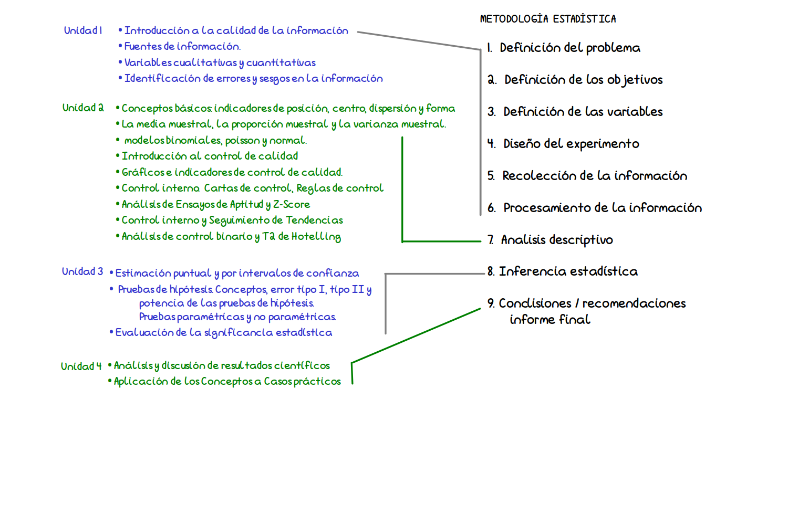
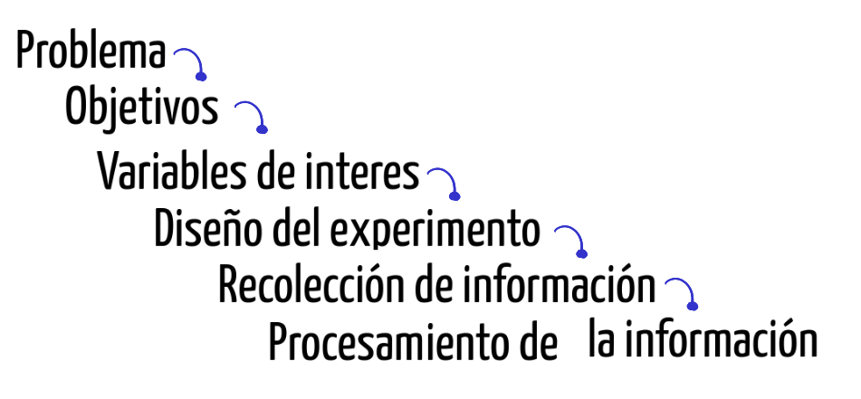
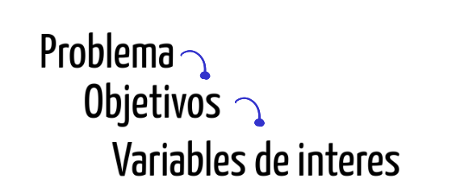
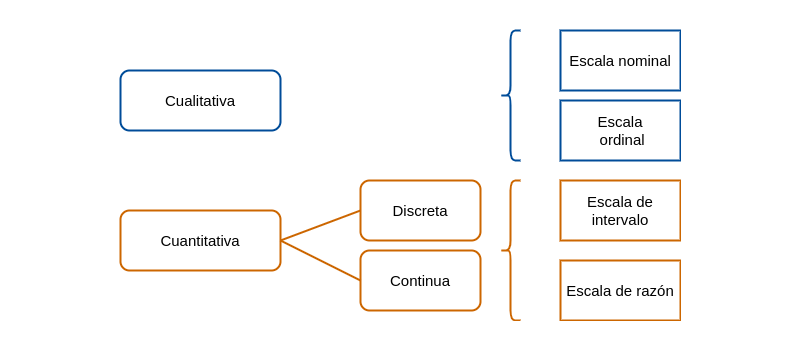

```{r setup, include=FALSE}
knitr::opts_chunk$set(echo = TRUE)
```
<br/><br/>

# **Profesores a cargo**

```{r, echo=FALSE, out.width="100%", fig.align='center'}

```

<br/><br/>

# **Contenido**

```{r, echo=FALSE, out.width="100%", fig.align='center'}

```

<br/><br/>


# **Metodología Estadística**

<br/><br/>

## **Unidad 1**

<br/><br/>

## **Temática**

* Introducción a la calidad de la información
* Fuentes de información
* Variables cualitativas y cuantitativas
* Identificacion de errores y sesgo en la información

<br/><br/>

## **Metodología Estadística**


1. Definición del problema
2. Definición de los objetivos
3. Definición de la variables
4. Diseño del experimento
5. Recolección de la información
6. Procesamiento de la información

<br/><br/>

## **Introducción a la calidad de la información**

<br/><br/>

Qué es la calidad?

"La calidad es la conformidad con los requisitos"
Philip B. Crosby

<br/><br/>

Qué es la CALIDAD DE LA INFORMACIÓN

Es la medida en que la información es precisa, relevante, confiable, oportuna y útil para su propósito previsto. En el contexto de la gestión de datos y la toma de decisiones, la calidad de la información es esencial para asegurar que la información proporcionada sea valiosa y efectiva para quienes la utilizan.


Es necesario conocer que es lo que hacemos para determinar si los datos cumplen con nuestros propósitos:

<br/><br/>


```{r, echo=FALSE, out.width="40%", fig.align='center'}

```

<br/><br/>

## **Definición del problema**


El planteamiento del problema puede tener varios orígenes, entre los cuales podemos mencionar:

* Inquietud personal por resolver un problema
* Lluvia de ideas de un grupo de personas
* Solicitud realizada por entidad externa, empresa o persona


Se recomienda en este caso iniciar con una revisión bibliográfica que permitan a los interesados buscar grupos de personas que enfrentan problemas similares, que tipo de soluciones ha propuesto o están implementando. Es posible que el problema al que nos enfrentamos ya tenga una buena solución y por tanto
no tendría sentido destinar una serie de recursos para estudiar lo que ya otros tienen solucionado.


En caso de tratarse de un problema con cierta frecuencia pero con características muy particulares, es
necesario además de la revisión bibliográfica determinar:

* Antecedente
* Preguntas de investigación
* Hipótesis de investigación
* Justificación del estudio
* Delimitación del problema

<br/><br/>

### **Ejemplos**

* Aumento de embarazos de adolescentes en Colombia durante la última década
* Incremento de los suicidios en adolescentes durante los últimos cinco años en Colombia
* Incremento de los homicidios en el Valle del Cauca en jóvenes entre 18 y 28 años

<br/><br/>

## **Definición de los objetivos**

Al iniciar una investigación uno de los primeros pasos debe ser el definir de la forma más clara el propósito u objetivo principal del estudio. Estos deben de estar orientados a la solución del problema

<br/><br/>

```{r, echo=FALSE, out.width="50%", fig.align='center'}

```

<br/><br/>

Los objetivos pueden ser:

Generales: definen a grandes rasgos el propósito del trabajo de investigación.

Específicos: definen en detalle los fines de la investigación. Cuanto más detallado sean los objetivos específicos más fácil será planear las etapas para lograrlos.

Algunos verbos utilizados para la especificación de los objetivos son: 

determinar, identificar, evaluar,analizar, comparar, examinar, proponer, validar, estimar, formular, .....

<br/><br/>

### **Ejemplos**

* Determinar los principales factores que han incidido en el aumento de la violencia en Colombia
* Identificar las principales causas de homicidios en Cali
* Establecer los principales factores que inciden en la elección de la carrera universitaria

<br/><br/>

## **Definición de variables**


```{r, echo=FALSE, out.width="40%", fig.align='center'}

```


<br/><br/>


```{r, echo=FALSE, out.width="100%", fig.align='center'}

```

<br/><br/>

Las variables se pueden clasificar según :

* origen : aleatorias, no aleatorias
* su naturaleza : cualitativas, cuantitativas (discretas, continuas)
* su relación con otras variables : dependientes, independientes

<br/><br/>

#### **Variables cualitativas - escala nominal**

Los valores son categorías no comparables, sin presencia de orden jerárquico distinto al alfabético entre ellos. Al comparar dos valores solo es posible afirmar que son iguales o que son diferentes ($=$=, $\neq$).


<br/><br/>

### **Ejemplo**

* Estado civil, (soltero, casado, unión libre, separado, viudo)
* Profesión (ingeniero, arquitecto, químico, médico, administrador....)
* Nacionalidad ( colombiano, venezolano, ecuatoriano....)
* Grupo sanguíneo (A, B, AB, O)


<br/><br/>

#### **Variables cualitativas - escala ordinal**

Los valores son categorías comparables, en el sentido de que se pueden ordenar de menor a mayor o a la inversa. ($=$, $\neq$ , $<$, $>$) cualitativa.

<br/><br/>

### **Ejemplo**

* Considera que el servicio que acaba de recibir es:
  * Excelente
  * Muy bueno
  * Bueno
  * Regular
  * Muy regular
  * Pésimo
  
<br/><br/>

#### **Variables cuantitativa  - escala intervalo**

Corresponde a valores numéricos, dentro de los cuales solo tiene sentido la diferencia entre dos de sus valores. ($=$,$\neq$, $<$ , $>$ , $-$)

<br/><br/>

### **Ejemplos**

Temperatura La variable se puede medir en diferentes tipos de escalas :

* Celsius ∘ C , (La escala Celsius fue creada Andrés Celsius (1742) . Esta escala tiene como referencia los puntos de congelación y ebullición del agua, límites que divide en 100 partes iguales.
* Kelvin K , Creada por William Thompson Kelvin (1848), en la que propone una transformación de la escala Celsius hasta un valor hipotético en el que hay ausencia de calor.
* Fahrenheit ∘ F Escala propuesta Gabriel Daniel Fahrenheit (1724), proponiendo una modificación a la escala Celsius.


T = 0 ºC

* K = 0 ºC + 273.15 = 273.15 ºK
* F = 0 ºC $\times$ 9/5+ 32 = 32 ºF

<br/><br/>

En ocasiones variables de tipo cualitativo no observables de manera directa como :

* Clima laboral
* Estrés
* Inteligencia
* Nivel de desempeño
* Calidad

<br/><br/>

Con frecuencia a las variables anteriores se les llama variables latentes debido a que su medición no es directa, sino que se realiza a través de preguntas que se recogen en un instrumento en muchos casos agrupados por
factores. Cada respuesta en las preguntas tiene un valor o puntaje que es sumado y determina los niveles de la variable. Los valores dados a las respuestas pueden cambiar de instrumento a instrumento, pues existen
escalas con 3 valores, otras con 5, 7 que que pueden representar una escala ordinal.

A esta transformación numérica (suma de los puntajes obtenidos al totalizar los puntajes obtenidos) se conoce como operacionalización a escala de intervalo de una variable cualitativa.

<br/><br/>

#### **Variables cuantitativa  - escala de razón**

Corresponde a valores numéricos, para los cuales además de las diferencias también tiene sentido la razón de dos de sus valores. ($=$, $\neq$, $<$ , $>$ , $-$, $\div$)


<br/><br/>


### **Ejemplo**

* Ingresos mensuales de una persona
* Cantidad de calorías que consume una persona diariamente
* Peso de un paciente
* Talla de un niño recién nacido
* Edad de una persona al morir

<br/><br/>


## **Diseño del estudio**

Después de tener claro los tres puntos anteriores, es necesario diseñar y prever todas las actividades necesarias para la recolección de la información requerida para el cumplimiento de los objetivos propuestos.
Esta parte comprende definir:

* Tipo de estudio
* Tipo de muestreo (en caso de requerirlo)
* Tamaño de la muestra

<br/><br/>


### **Tipo de estudio**

* Experimental
  * Experimento puro
  * Cuasi-experimento

* No experimental
  * Transeccional
  * Exploratorio
  * Descriptivo de uno o más grupos
  * Longitudinal
  * De tendencia
  * De evolución de grupo
  
<br/><br/>

### **Experimental**  

<br/><br/>

#### **Experimento puro**

Tambien llamado experimento controlado, es el tipo de experimento donde se manipulan (controlan) todas las variables excepto la variable objeto de estudio.

El objetivo principal es aislar las variables independientes para obtener su efecto sobre una variable
dependiente, de tal forma que se pueda medir su relación causal.

Se utiliza grupo control, se emplea aleatorización para asignación de niveles - Por lo general se desarrolla en laboratorios  
  
<br/><br/>

#### **Cuasi-experimento**

Semejante al anterior, pero debido a restricciones éticas no se pueden hacer asignaciones aleatorias a los grupos experimentales y de control. Mantiene los grupos de control y experimental para medir efecto de causalidad

<br/><br/>

### **No experimental**

<br/><br/>

#### **De corte transversal**

Se recopilan datos de una población en un solo punto en el tiempo para examinar las relaciones entre variables en ese momento.

<br/><br/>

#### **Correlacionales**

Evalúan la relación entre dos o más variables sin intervenir en ninguna de ellas. Estos estudios pueden revelar asociaciones, pero no establecen causalidad.

<br/><br/>

#### **Exploratorio**

Su objetivo principal es explorar, descubrir y generar ideas preliminares o hipótesis sobre un tema o fenómeno específico. Estos estudios suelen realizarse al comienzo de un proceso de investigación más amplio
y pueden ayudar a definir preguntas de investigación más específicas y diseñar investigaciones posteriores.

<br/><br/>

## **Algunos conceptos básicos**

<br/><br/>

### **Población, Censos - Parámetro**

* Población: Conjunto de elementos acerca de los cuales deseamos realizar alguna inferencia.

* Censo: Estudio que incluye todos los elementos de una población

* Parámetro: Caracteristica de una población.

<br/><br/>

### **Muestra, Muestreo, Estimador**

* Muestra: Subconjunto de elementos una población, elegidos de un marco muestral.

* Muestreo: Forma de selección de una parte de la población.

* Marco muestral: Listado completo de unidades que conforman una población.

* Unidad de muestreo Persona u objeto de la cual se toma la información.

<br/><br/>

### **Tipo de muestreo**

* Muestreo probabilístico

  * Muestreo aleatorio simple
  * Muestreo aleatorio estratificado
  * Muestreo aleatorio por conglomerados
  * Muestreo sistemático
  * Muestreo compuestos

<br/><br/>

* Muestreo no probabilístico

  * Muestreo por conveniencia
  * Muestreo por juicio
  * Muestreo por cuotas
  * Muestreo bola de nieve
  
<br/><br/>  
  
#### **Muestreo Aleatorio Simple**

En este tipo de muestreo se seleccionan los elementos de la población de tal manera que cada elemento tenga igual probabilidad de ser elegido.

Para realizarlo se requiere de poseer un marco muestral actualizado y un sistema que permita la escogencia de las unidades de manera aleatoria.

<br/><br/>

#### **Muestreo Aleatorio Estratificado**

Una muestra estratificada se toma separando los elementos de la población en estratos y en cada uno de ellos por separado se toma una muestra aleatoria simple.

El supuesto que valida este procedimiento se centra en la varianza al interior de los estratos es menor que la varianza que presentan los individuos al total de la población. Esto permite controlar la varianza de la variable
principal, es decir cambiar una población heterogénea por varias homogéneas.


<br/><br/>

#### **Muestreo Aleatorio Sistemático**

En este tipo de muestreo se selecciona la muestra mediante la elección de un punto de inicio de manera aleatoria ($r$) dentro de los $k$ primeros números de la población y la muestra queda determinada por la secuencia: $r, r + k, r + 2k, r + 3k, ........$ hasta completar el tamaño de la muestra requerida.

Para obtener una muestra aleatoria, establecemos de número aleatorio entre $1$ y $k$ y de esta forma quedan determinados los elementos de la muestra.

<br/><br/>

#### **Muestreo Aleatorio por Conglomerados**

Cuando la población objeto de estudio se encuentra dividida en subpoblaciones mutuamente excluyentes - llamados conglomerados - y bajo el supuesto de que cada uno de ellos representa la población, el muestreo por conglomerados proporciona una buena alternativa para realizar un muestreo.

En este caso se debe tener una relación de todos los conglomerados que conforman la población y a partir de este listado se realiza un muestreo aleatorio simple de ellos. Al interior del o los conglomerados seleccionados
de esta manera se realiza censo o en otras ocasiones muestreo aleatorio simple.

<br/><br/>

## **Muestreos no probabilísticos**

<br/><br/>

### **Muestreo por conveniencia**

En este tipo de muestreo la selección de los elementos de la muestra están a criterio del entrevistador, por lo
general son seleccionados por estar en el lugar adecuado.

<br/><br/>

### **Muestreo por juicio**

Forma de muestreo por conveniencia cuyos elementos se seleccionan de manera intencional con base en el
juicio del investigador

<br/><br/>

### **Muestreo por cuotas**

Muestreo por juicio restringido a dos etapas:
Etapa 1: Desarrollo de categorías o cuotas de los elementos de la población (\%)
Etapa 2: Los elementos se seleccionan de acuerdo a la conveniencia o el juicio del investigador hasta
completar el número establecido para cada subgrupo.

<br/><br/>

### **Muestreo bola de nieve**

En este método se selecciona inicialmente un grupo de entrevistados. El resto de entrevistados se eligen de
acuerdo a información suministrada por los mismos entrevistados -referidos-. Este método permite obtener
información rápida y muy fácilmente.

<br/><br/>

## **Recolección de la información**

Esta etapa comprende el trabajo de campo, la cual implica las siguientes actividades:

<br/><br/>

* Construcción o actualización del marco muestral
* Selección de encuestadores o personas que toman la información
* Adiestramiento de estas personas
* Prueba piloto (ensayo de los instrumentos de medición)
* Construcción y mejoramiento de la plantilla o instrumento de recolección de los datos
* Construcción de la base de datos. (Plantilla para captura de datos)
* Manual de la plantilla o instrumento de recolección de datos
* Selección de las unidades que conforman la muestra
* Selección de las unidades de holgura
* Coordinación del recibo de la información

<br/><br/>

## **Procesamiento de la información**

Esta etapa comprende la construcción de la base de datos para que sea procesada posteriormente en un
paquete estadístico. Entre los más usados están:

<br/><br/>

* SPSS
* Stata
* Minitab
* SAS
* Statgraphics
* Eviews
* R/Rstudio


<br/><br/>


