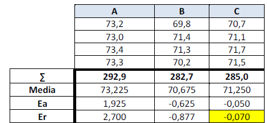
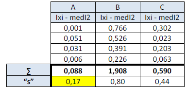

```{r setup, include=FALSE}
knitr::opts_chunk$set(echo = TRUE, comment = NA)
```

<br/>


## **Conceptos previos**

<br/><br/>

### **Ejemplo 1**

En un estudio de $50$ cultivos se obtuvieron los siguientes resultados en el recuento de microorganismos

<pre>
78, 77, 69, 80, 85, 69, 78, 77, 76, 69, 65, 66, 78, 69, 90, 81, 82, 75, 72, 73, 
71, 68, 67, 69, 68, 78, 79, 72, 73, 92, 91, 84, 86, 82, 74, 72, 73, 95, 76, 69, 
78, 77, 95, 68, 73, 72, 85, 81, 80, 70
</pre>

<br/>

su media, desviación estandar y mediana tienen un valor de :

```{r}
cultivos<-c(78, 77, 69, 80, 85, 69, 78, 77, 76, 69, 65, 66, 78, 69, 90, 81, 82, 75, 72, 73, 71, 68, 67, 69, 68, 78, 79, 72, 73, 92, 91, 84, 86, 82, 74, 72, 73, 95, 76, 69, 78, 77, 95, 68, 73, 72, 85, 81, 80, 70)

mean(cultivos)  # media
sd(cultivos)    # desviación estandar
median(cultivos) # mediana

```


<br/><br/>

Ayuda el poder visualizar los datos mediante gráficos que permitan entender el valor de los indicadores obtenidos

```{r, fig.width=10}
nf <- layout( matrix(c(2,1), nrow=1) )
hist(cultivos,xlab="Conteo de microorganismos",ylab="Frecuencia  Absoluta", las=1, panel.first=grid(),col="white",border="red4",lwd=2,main="")
boxplot(cultivos , xlab="Conteo de microorganismos" , col="white", las=1)
```


<br/><br/>


### **Ejemplo 2**


Ustedes saben que el calcio (Ca2+) es un catión con capacidad multifuncional como segundo mensajero en diferentes grupos celulares del sistema inmunitario que incluyen los linfocitos T y B, los macrófagos, los mastocitos, entre otras. En un laboratorio, se calculó el contenido en Ca2+ en una muestra de $200$ ml de agua, obteniendo los siguientes resultados, expresados en g de Ca por cada $100$ ml de agua.

<br/>

<pre>
0.04045, 0.04040, 0.04038, 0.04042, 0.04035, 0.04042, 0.04044, 0.04045, 0.04038, 0.04039
</pre>


```{r}
ca<-c(0.04045, 0.04040, 0.04038, 0.04042, 0.04035, 0.04042, 0.04044, 0.04045, 0.04038, 0.04039)
cat("media               : ",mean(ca), "\n")
cat("moda                : ",mode(ca),"\n")
cat("mediana             : ",median(ca),"\n")
cat("desviación estandar :",sd(ca),"\n")
```

<br/><br/>


### **Ejemplo 3**

En un análisis de calcio, se realizó por tres métodos distintos. Los resultados se prsentan a continuación. ¿Qué método fue más preciso? ¿Qué método fue más exacto?

<br/>

```{r}
Lab_A=c(73.2, 73.0, 73.4, 73.3)
Lab_B=c(69.8, 71.4, 71.3, 70.2)
Lab_C=c(70.7, 71.1, 71.7, 71.5)
datos=data.frame(Lab_A,Lab_B,Lab_C)
datos
```

<br/><br/>


```{r,  echo=FALSE}
library(RColorBrewer)
summary(datos)
boxplot(Lab_A,Lab_B,Lab_C,  col = brewer.pal(3, "Dark2"))
```
<br/><br/>


```{r,  echo=FALSE}

coef_var <- function(x, na.rm = FALSE) {
  sd(x, na.rm=na.rm) / mean(x, na.rm=na.rm)
}

coef_var(datos$LabA) # coeficiente de variación laboratorio A
coef_var(datos$LabB) # coeficiente de variación laboratorio B
coef_var(datos$LabC) # coeficiente de variación laboratorio C

```

<br/><br/>

## **Exactitud**

<p style = 'text-align:center;'>

<p>

El método más exacto es el C puesto que tiene un menor error absoluto.

<br/><br/>

## **Precisión**

<p style = 'text-align:center;'>

<p>

El valor más pequeño de "s" indica una mayor precisión, en este caso el método A.

<br/><br/>
# **Gracias!**