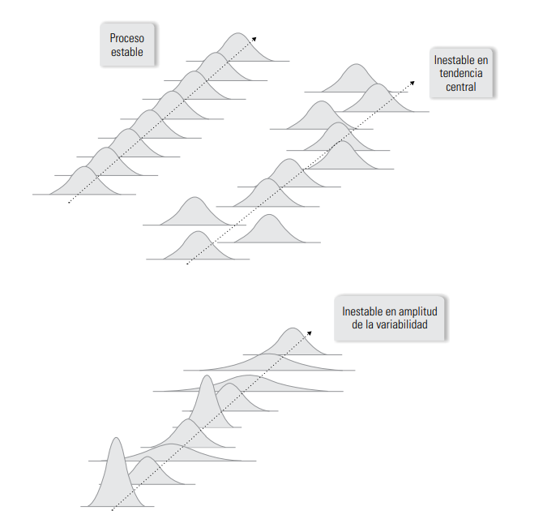
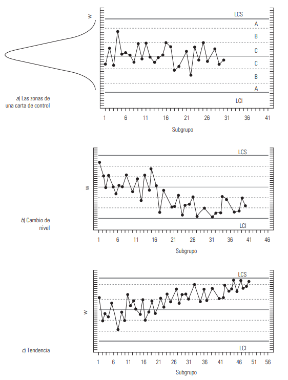
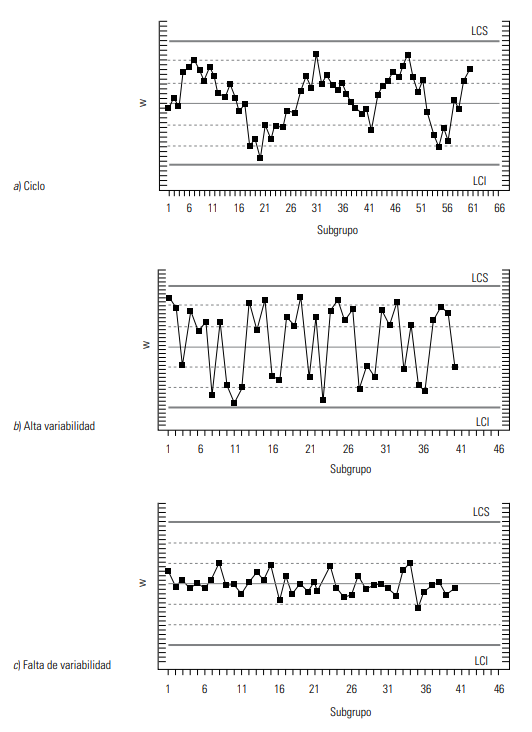
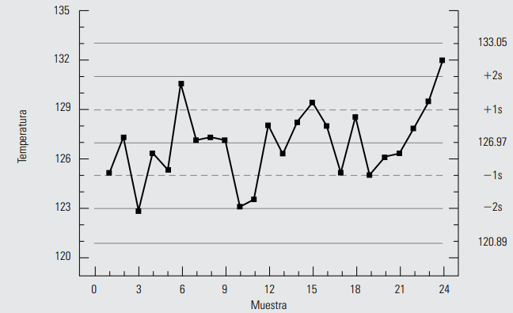
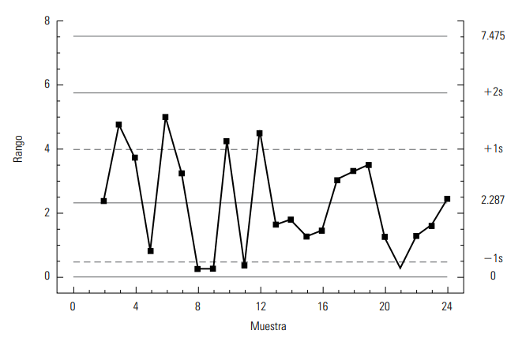

```{r setup, include=FALSE}
knitr::opts_chunk$set(echo = TRUE, comment = NA)
```

<br/>

## **Conceptos previos**

<p style = 'text-align:center;'>

<p>


## **Límites de control**

La ubicación de los límites de control en una carta es crucial, ya que influye en la capacidad de detectar cambios en un proceso. 
Si los límites están muy alejados de la línea central, se dificulta la detección de cambios, mientras que si están demasiado estrechos, se aumenta la probabilidad de cometer errores tipo 1 (declarar un cambio cuando no lo hay).

<br/>

Para calcular los límites de control, se busca que el estadístico graficado en la carta tenga una alta probabilidad de caer dentro de estos límites bajo condiciones de control estadístico. 

Se pueden utilizar límites de probabilidad, donde se determinan los límites de manera que un alto porcentaje de la distribución de probabilidad del estadístico esté dentro de ellos.

<br/>

Una forma simple es basarse en la relación entre la media ($\mu$) y la desviación estándar ($\sigma$) de una variable. En condiciones de control estadístico, se establece que entre $\mu-3\sigma$ y $\mu+3\sigma$ se encuentran el $99.73\%$ de los posibles valores de la variable, lo que permite detectar desviaciones significativas del proceso.

<br/><br/>

Si la distribución de la variable no es normal pero es unimodal y se asemeja a la normal, se pueden aplicar reglas empíricas o el teorema de Chebyshev. Los límites de control inferior (LCI), la línea central y el límite de control superior (LCS) se calculan de acuerdo con esta relación:

$$LCI=\mu_w - 3\sigma_w$$

$$Línea\; Central = \mu_w$$

$$LCS = \mu_w + 3\sigma_w$$

donde $w$ es el estadístico que se va a graficar en la carta superior.

Estos límites se utilizan para determinar si los valores del estadístico $w$ están dentro de ellos bajo condiciones de control estadístico. Si $w$ sigue una distribución normal, se espera que solo el $0.27\%$ de los puntos caigan fuera de los límites, lo que significa que la mayoría de las observaciones deben estar dentro de los límites. Estos tipos de cartas de control, conocidos como cartas de **control tipo Shewhart**.

<br/><br/>

## **Tipos de cartas de control**

<br/>

Las **cartas de control para variables** se aplican a características de calidad que son de tipo continuo y requieren una medición con un instrumento. Los tipos más comunes de cartas de control para variables tipo Shewhart incluyen cartas a 
- $\bar{X}$ (para medias) 
- $R$ (para rangos), cartas a - $S$ (para desviaciones estándar) 
- $X$ (para medidas individuales).

Estos corresponden al estadístico que se representa en la carta y se utilizan para analizar características importantes en productos o procesos.

<br/>

Por otro lado, existen características de calidad que no se evalúan en una escala continua o numérica, sino que se determinan por la presencia o ausencia de ciertos atributos (como conformidad o no conformidad) o se cuentan el número de defectos o no conformidades. 

Estas características se monitorean a través de las **cartas de control para atributos**. Los tipos comunes de cartas de control para atributos incluyen cartas a 

* $p$ (para proporción o fracción de artículos defectuosos) 
* $np$ (para el número de unidades defectuosas) 
* $c$ (para el número de defectos) 
* $u$ (para el número promedio de defectos por unidad).

<br/><br/>

### **Carta de control** $\bar{X}-R$

Existen procesos que son "masivos", es decir, que producen una gran cantidad de artículos, partes o componentes en un corto período de tiempo. Estos procesos pueden realizar desde miles hasta decenas o centenas de operaciones por día.

En el contexto de procesos masivos donde las variables de salida son de tipo continuo, las cartas de control $\bar{X}-R$ son ideales. 

**Idea:** A medida que los productos salen del proceso, se toma un pequeño número de ellos en intervalos regulares o por lotes (subgrupos), y se realiza una medición de una o más características de calidad en cada subgrupo. Con estas mediciones, se calcula la media y el rango del subgrupo. A lo largo del tiempo, se obtiene una media y un rango muestral que proporcionan información sobre la tendencia central y la variabilidad del proceso, respectivamente.
<br/>

* La carta $\bar{X}$ se utiliza para analizar la variación entre las medias de los subgrupos, lo que permite detectar cambios en la media del proceso. 
* La carta $R$, por otro lado, se utiliza para analizar la variación entre los rangos de los subgrupos, lo que permite detectar alteraciones en la amplitud o magnitud de la variación del proceso.

<br/><br/>




<br/><br/>

### **Límites de control de la carta** $\bar{X}$

En el caso de la carta de medias el estadístico $w$ es la media de los subgrupos, $\bar{X}$, por lo que los límites están dados por: 

$$\mu_{\bar{X}} \pm 3\sigma_{\bar{X}}$$

donde $\mu_{\bar{x}}$ significa la media de las medias, y $\sigma_{\bar{X}}$ la desviación estándar de las medias, que en un estudio inicial se estiman de la siguiente manera: $$\mu_{\bar{x}} = \bar{x} \text{ y  } \sigma_{\bar{X}} = \frac{\sigma}{\sqrt{n}}$$

donde $\bar{X}$ es la media de las medias de los subgrupos, $\sigma$ la desviación estándar del proceso, que indica qué tan variables son las mediciones individuales, y $n$ es el tamaño de subgrupo. 

Cuando se conoce la media $\mu$ y la desviación estandar del proceso $\sigma$, los límites estan dados por:

$LCS = \mu + 3\frac{\sigma}{\sqrt{n}}$

Línea central = $\mu$

$LCS = \mu + 3\frac{\sigma}{\sqrt{n}}$


<br/><br/>

### **Interpretación de los límites de control en una carta** $\bar{X}$

Estos límites reflejan la variación esperada para las medias muestrales de tamaño $n$, mientras el proceso no tenga cambios importantes. Los límites se utilizan para detectar cambios en la media del proceso y para evaluar su estabilidad.

Los límites de control en una carta de medias tampoco son igual a los límites reales o naturales del proceso, ya que reflejan la variación esperada para las mediciones individuales y no para la media de $n$.

La interpretación correcta de los límites de control es de especial relevancia para una adecuada aplicación de la carta $\bar{X}$, ya que de lo contrario se caerá en el error de confundir los límites de control con las especificaciones o con los límites reales. Estos errores generalmente traen como consecuencia que se trate de utilizar la carta para evaluar capacidad, cuando se debe usar para analizar estabilidad y detectar cambios en la media del proceso de manera oportuna.

Por último, aunque los límites de control de una carta $\bar{X}$ se deducen a partir del supuesto de normalidad, si la característica de calidad tiene desviaciones moderadas de la normalidad, la carta $\bar{X}$ se puede seguir aplicando, esto debido al teorema central del límite.


<br/><br/><br/>

## **Carta de control** $R$

Con la **carta** $R$ se detectan cambios en la amplitud o magnitud de la variación del proceso, como se ilustra en la Figura 1.

<br/><br/>

### **Límites de control de la carta** $R$

Se determinan a partir de la media y la desviación estándar de los rangos de los subgrupos, ya que en este caso es el estadístico $w$ que se grafica. Por ello, los límites se obtienen con la expresión:

$$\mu_R = \pm 3\sigma_R$$

donde $\mu_R$ significa la media de los rangos, y $\sigma_R$ la desviación estándar de los rangos, que se estiman de la siguiente manera:

$$\mu_R= \bar{R} \text{ y }\sigma_R = d_3\sigma \approx \left(d_3\frac{\bar{R}}{d_2}\right)$$ 
donde $\bar{R}$ es la media de los rangos de los subgrupos, $s$ la desviación estándar del proceso, $d_3$ es una constante que depende del tamaño del subgrupo. Como por lo general no se conoce $\sigma$, que se estima como $\bar{R}/d_2$. Los límites de la carta $R$ se estiman de la siguiente manera:

$$LCI = \bar{R} - 3d_3\left(\frac{\bar{R}}{d_2}\right) = \left(1-3\frac{d_3}{d_2}\right)\bar{R} = D_3\bar{R}$$ 
Línea central = $\bar{R}$

$$LCI = \bar{R} + 3d_3\left(\frac{\bar{R}}{d_2}\right) = \left(1+3\frac{d_3}{d_2}\right)\bar{R} = D_4\bar{R}$$ 

donde $D_3$ y $D_4$ se usan para simplificar los cálculos.


<br/><br/>

### **Interpretación de los límites de control**

Los límites en una carta $R$ indican la variación esperada para los rangos muestrales de tamaño $n$, mientras el proceso no tenga un cambio significativo. Estos límites se utilizan para detectar cambios en la amplitud o magnitud de la variación del proceso y para ver qué tan estable permanece a lo largo del tiempo, pero por ningún motivo se deben emplear para evaluar la capacidad.

<br/><br/>

### **Estado del proceso en cuanto a capacidad y estabilidad**

En la interpretación de los límites de la carta $\bar{X}$, sus límites de control no son equivalentes a las especificaciones o tolerancia de la característica de calidad. Por ello, dos asuntos diferentes de un proceso son su estabilidad, que se evalúa con las cartas de control, y su capacidad para cumplir especificaciones, que se evalúa con los índices de capacidad.

<br/><br/>

### **Límites de control de la carta** $\bar{X}- R$ **y su revisión futura**

Se debe realizar un estudio inicial durante un período suficientemente representativo, dependiendo de la velocidad del proceso y el tipo de carta de control. Este período debe ser lo bastante largo para captar los cambios cotidianos en el proceso.

Una vez que se recopilan los datos, se calculan los límites preliminares para la carta de medias y la carta de rangos utilizando fórmulas específicas. Si los datos indican que el proceso está bajo control estadístico tanto en términos de variabilidad como de tendencia central, se utilizan estos límites para monitorear el proceso en tiempo real.

Si en el estudio inicial se observan pocos puntos fuera de los límites de control, se investiga la causa de estos puntos y, si se identifica, se excluyen los datos correspondientes antes de recalcular los límites. Si no se encuentra una causa clara, es recomendable conservar los datos y trabajar con los límites iniciales.

En casos donde muchos puntos se salen de los límites en el estudio inicial, excluirlos puede no ser apropiado ni práctico. En su lugar, se analiza el patrón formado por estos puntos en la carta para mejorar el proceso y lograr una mayor estabilidad.

Una vez que se establecen límites de control definitivos, solo se cambian si el proceso experimenta cambios significativos, como una reducción significativa de la variabilidad o una mejora en la tendencia central. En algunos casos, se revisan periódicamente los límites, pero esto debe hacerse con precaución, ya que intervalos muy cortos pueden no detectar ciertos cambios o tendencias en el proceso.

<br/><br/>

### **Interpretación de las cartas de control y las causas de inestabilidad**

Una señal de la presencia de causas especiales ocurre cuando un punto se encuentra fuera de los límites de control o cuando los puntos muestran un patrón no aleatorio en la carta. Para facilitar la identificación de estos patrones, la carta se divide en seis zonas o bandas iguales, cada una con una amplitud similar a una desviación estándar del estadístico $w$.

Los patrones ayudan a determinar cuándo un proceso es inestable y qué tipo de causas están contribuyendo a esa inestabilidad. Un proceso muy inestable suele estar mal estandarizado y puede experimentar cambios continuos o una alta variación.

Para identificar estos patrones no aleatorios, se utilizan pruebas estadísticas que se basan en supuestos de normalidad e independencia entre y dentro de los subgrupos de datos. Si estos supuestos no se cumplen, las pruebas deben interpretarse con precaución.

<br/><br/>


## **Patrón 1.** 
### **Desplazamiento o cambios en el nivel de proceso**

Este patrón ocurre cuando uno o más puntos se salen de los límites de control o cuando hay una tendencia larga y clara a que los puntos consecutivos caigan de un solo lado de la línea central como lo muestra la Figura 2.



<br/><br/>

Estos cambios especiales pueden ser por: 

* La introducción de nuevos trabajadores, máquinas, materiales o métodos. 
* Cambios en los métodos de inspección. 
* Una mayor o menor atención de los trabajadores. - Un proceso mejor (o peor).

Cuando este patrón ocurre en las cartas $\bar{X}, p, np, u$ o $c$, se dice que hubo un cambio en el nivel promedio del proceso. 
En la carta $R$ un cambio de nivel significa que la variabilidad aumentó o disminuyó, aunque por la falta de simetría de la distribución de $R$, el patrón del lado inferior de estas cartas se debe ver con más reservas y esperar a acumular más puntos por abajo de la línea central para declarar que hay un cambio significativo (disminución de la variabilidad).

Los criterios usuales para ver si este patrón se ha presentado son:

* Un punto fuera de los límites de control.
* Una tendencia clara y larga a que los puntos consecutivos caigan de un solo lado de la línea central (ver Figura 2b). Tres pruebas concretas para este patrón son: ocho o más puntos consecutivos de un solo lado de la línea central; al menos 10 de 11 puntos consecutivos caen de un mismo lado de la línea central; y por lo menos 12 de 14 puntos consecutivos ocurren por un mismo lado de la línea central.


<br/><br/>

## **Patrón 2.** 
### **Tendencias en el nivel del proceso**

Este patrón consiste en una tendencia a incrementarse (o disminuirse) los valores de los puntos en la carta, como se aprecia en la Figura 2c). Una tendencia ascendente o descendente bien definida y larga se puede deber a algunas de lo siguientes:

* El deterioro o desajuste gradual del equipo de producción.
* Desgaste de las herramientas de corte.
* Acumulación de productos de desperdicio en las tuberías.
* Calentamiento de máquinas.
* Cambios graduales en las condiciones del medio ambiente.

Estas causas se reflejan prácticamente en todas las cartas excepto en la $R$, cuyas tendencias son raras, pero cuando se dan, puede deberse a la mejora o decrecimiento de la habilidad de un operario, a su fatiga (la tendencia se repetirá en cada turno) o al cambio gradual en la homogeneidad de la materia prima. Para determinar si existe una tendencia en el proceso, se siguen estos criterios:

* Seis o más puntos consecutivos ascendentes (o descendentes).
* Un movimiento de muchos puntos hacia arriba (o hacia abajo) de la carta de control, aunque no todos los puntos vayan en ascenso (o descenso). En la Figura 2c) se muestra una tendencia creciente de los puntos, que es demasiado larga para considerarse que es ocasionada por variaciones aleatorias, por lo que más bien es señal de que algo especial (desplazamiento) está ocurriendo en el proceso correspondiente. En ocasiones pueden presentarse aparentes tendencias causadas por variaciones naturales y del muestreo del proceso, por eso la tendencia debe ser larga para considerarla especial. Cuando se presente una tendencia y se dude si es especial, hay que estar alerta para ver si efectivamente está ocurriendo algo inusual en el proceso.

<br/><br/>

## **Patrón 3.** 
### **Ciclos recurrrentes (periodicidad)**




Otro movimiento no aleatorio que pueden presentar los puntos en las cartas es un **comportamiento cíclico de los puntos**, como se muestra en Figura 3. Cuando un comportamiento cíclico se presenta en a carta $\bar{X}$, las posibles causas son:

* Cambios periódicos en el ambiente.
* Diferencias en los dispositivos de medición o de prueba que se utilizan en cierto orden.
* Rotación regular de máquinas u operarios.
* Efecto sistemático producido por dos máquinas, operarios o materiales que se usan alternadamente.

Si el comportamiento cíclico se presenta en la carta $R$, entonces algunas de las posibles causas son mantenimiento preventivo programado o fatiga de trabajadores o secretarias. Las cartas $p, np, c$ y $u$ se ven afectadas por las mismas causas que las cartas de medias y rangos.


<br/><br/>

## **Patrón 4.** 
### **Mucha variabilidad**

Se manifiesta mediante la alta proporción de puntos cerca de los límites de control, a ambos lados de la línea central, y pocos o ningún punto en la parte central de la carta. En estos casos se dice que hay mucha variabilidad (ver en la Figura 3b). Algunas causas que pueden afectar a la carta de esta manera son:

* Sobrecontrol o ajustes innecesarios en el proceso.
* Diferencias sistemáticas en la calidad del material o en los métodos de prueba.
* Control de dos o más procesos en la misma carta con diferentes promedios.

Las cartas $R$, se pueden ver afectadas por la mezcla de materiales de calidades bastante diferentes, diversos trabajadores utilizando la misma carta $R$ y datos de procesos operando bajo distintas condiciones graficados en la misma carta. Los criterios para detectar la alta proporción de puntos cerca o fuera de los límites son Ocho puntos consecutivos a ambos lados de la línea central con ninguno en la zona C (una imagen similar a la mostrada en la Figura 3b).


<br/><br/>

## **Patrón 5.**
## **Falta de variabilidad (estratificación)**


Cuando la mayoría de los puntos en una carta de control se agrupan en la parte central, indicando poca variabilidad o estatificación en los datos. Esto puede deberse a varias causas, como errores en el cálculo de los límites de control, combinación de datos con medias muy diferentes en una misma muestra, inconsistencias en la recopilación de resultados o el uso de una carta de control inadecuada para el estadístico en cuestión.

Para detectar la falta de variabilidad en un proceso, se establecen criterios, como la presencia de quince puntos consecutivos en la zona central de la carta o un patrón similar de agrupamiento de puntos.

Cuando se observa cualquiera de estos patrones en una carta de control, indica que el proceso está experimentando una situación especial, es decir, está fuera de control estadístico. Esto no significa necesariamente que la producción deba detenerse, pero sí que el proceso está sujeto a variaciones debido a causas específicas, como materiales heterogéneos, cambios de operadores o diferencias entre máquinas. En estos casos, es fundamental investigar y comprender las causas subyacentes para tomar medidas correctivas y preventivas.

<br/><br/>

### **Ejemplo Control de la temperatura de un proceso**

En una empresa se hacen impresiones en láminas de acero, que posteriormente se convierten en recipientes de productos de otras empresas. Un aspecto importante a vigilar en dicha impresión es la temperatura de "horneada" que, entre otras cosas, adhiere y seca la pintura una vez que se imprimió. En una fase particular de la horneada se tiene que la temperatura de cierto horno debe ser 125°C, con una tolerancia de 65°C. Si no se cumple con tal rango de temperatura, entonces se presentan problemas en la calidad final de la impresión.

Para controlar de manera adecuada tal característica de proceso se usa una carta de control, y evidentemente aquí no tiene sentido tomar una muestra de tamaño cuatro, ya que si se miden las temperaturas del horno de manera consecutiva, entonces estas serán prácticamente las mismas; y si las mediciones no se hacen de manera consecutiva y se hacen, por ejemplo, cada hora, entonces habrá que esperar cuatro horas para graficar un punto en la carta de control y así analizar el proceso. De este modo resulta más práctico hacer, periódicamente, una medición de la temperatura en el horno, y en cuanto se obtiene el dato graficarlo en la carta. Es decir, resulta más práctico llevar una carta de control para individuales.

<br/><br/>


**Tabla 1:** Datos Control de la temperatura de un proceso

| Muestra | Temperatura en el horno | Rango móvil | Muestra | Temperatura en el horno | Rango móvil          |
|------------|--------------|------------|------------|--------------|------------|
| 1       | 125.1                   | 13          | 13      | 126.4                   | 1.6                  |
| 2       | 127.5                   | 2.4         | 14      | 128.3                   | 1.9                  |
| 3       | 122.7                   | 4.8         | 15      | 129.5                   | 1.2                  |
| 4       | 126.4                   | 3.7         | 16      | 128.1                   | 1.4                  |
| 5       | 125.5                   | 0.9         | 17      | 125.1                   | 3.0                  |
| 6       | 130.5                   | 5.0         | 18      | 128.5                   | 3.4                  |
| 7       | 127.3                   | 3.2         | 19      | 125.0                   | 3.5                  |
| 8       | 127.5                   | 0.2         | 20      | 126.3                   | 1.3                  |
| 9       | 127.3                   | 0.2         | 21      | 126.5                   | 0.2                  |
| 10      | 123.0                   | 4.3         | 22      | 127.9                   | 1.4                  |
| 11      | 123.5                   | 0.5         | 23      | 129.5                   | 1.6                  |
| 12      | 128.0                   | 4.5         | 24      | 131.9                   | 2.4                  |
|         |                         |             |         | $\bar{X} = 126.97$      | $\bar{R} = 2.287$ |


<br/><br/>

En la Tabla 1 se muestran las temperaturas obtenidas en tres días, midiendo la temperatura en el horno cada hora.

La segunda columna en dicha tabla representa los rangos entre temperaturas consecutivas.

Los límites de control para la carta de individuales son los siguientes:

$LCS$ = 126.97 + (3x2.287/1.128) = 133.05

Línea central = 126.97

$LCI$ = 126.97 - (3x2.287/1.128) = 120.97

La carta de control obtenida se muestra en la Figura 4, en la cual, no hay puntos fuera de los límites de control.

Sin embargo, en las últimas mediciones de temperatura aparece una tendencia, ya que hay seis puntos consecutivos de manera ascendente. De esta forma, alguna causa especial provocó una tendencia a que la temperatura se incrementara en el último día, por lo que se debe actuar de inmediato para identificarla, lo cual permite prevenir problemas más graves en la impresión de las láminas de acero.

<br/>

Los responsables del proceso identificaron tal tendencia como una señal de que ya era necesario el mantenimiento periódico que se le da al horno. También en la misma carta se aprecia que el proceso estuvo ligeramente descentrado, ya que la temperatura promedio fue de 126.97°C, y no de 125° como se desea; esto también pudo ser causa de la necesidad de mantenimiento. La decisión que se tomó fue dar mantenimiento al horno y volver a tomar datos para establecer los nuevos límites de control.

<br/><br/>




<br/><br/>

### **Carta de individuales**

Se aplica a procesos lentos en los cuales para obtener una medición de la variable bajo análisis se requieren periodos relativamente largos. 

La mejor alternativa a es usar una carta de individuales, en la que cada medición particular de la variable que se quiere analizar se registra en una carta.

Para determinar los límites de control se usa la estimación de la media y la desviación estándar del estadístico $w$ que se grafica en la carta, que en este caso es directamente la medición individual de la variable X. Por ello, los límites se obtienen con la expresión $\mu_x = \bar{X} \pm 3\sigma_x$. Donde $\mu_x$ y $\sigma_x$ son la media y la desviación estándar del proceso, respectivamente. Es decir, los límites de control en este caso coinciden por definición con los límites reales.

En un estudio inicial, estos parámetros se estiman de la siguiente manera:

$$\mu_x = \bar{X} \text{ y }\sigma_x = \frac{\bar{R}}{d_2}=\frac{\bar{R}}{1.128}$$

donde $\bar{X}$ es la media de las mediciones de los subgrupos y $\bar{R}$ es la media de los rangos móviles de orden dos (rango entre dos observaciones sucesivas en el proceso del ejemplo anterior). Al dividir el rango promedio entre la constante $d_2$ se obtiene una estimación de la desviación estándar del proceso, $\sigma$. Además, como en este caso, el rango móvil es de orden dos, entonces el valor de $n$ para determinar $d_2$ será $n=2$; por lo tanto, cuando $n=2$, $d_2=1.128$. De
lo anterior se concluye que los límites de control para una carta de individuales están dados por:

$$\bar{X}= \pm 3\left(\frac{\bar{R}}{1.128}\right)$$


<br/><br/>

### **Carta de rangos móviles**

La **carta de rangos móviles** se ha usado como complemento a la carta de individuales y grafica el rango móvil de orden dos para detectar cambios en la dispersión del proceso. Por ello, hay una tendencia a solo utilizar la carta de individuales. La Figura 5 muestra se muestra un ejemplo con los datos del ejemplo anterior. Los límites de control se obtienen de la misma forma que una carta de rangos, solo que en este caso las constantes $D_3$ y $D_4$ se obtienen usando el tamaño de subgrupo $n=2$. Por lo tanto, de acuerdo con los datos de la Tabla 1, los límites de esta carta están dados por:

Límite de control inferior = $D_3\bar{R}=0x2.287=0$

Línea central = $\bar{R} = 2.287$

Límite de control superior = $D_4\bar{R}=3.26886x2.287=7.475$

<br/>

Por lo que se espera que las diferencias (rangos) entre dos mediciones consecutivas de la temperatura del horno varíen entre cero y 7.475, con un promedio de 2.287. Además de la carta de rangos como se muestra en la Figura 5, se observa que no hay ningún punto fuera de los límites de control ni algún patrón especial. Por lo que se puede concluir que el proceso está en control estadístico en cuanto a variabilidad. No así en cuanto a tendencia central, como ya se vio en la carta de la Figura 4. 

<br/><br/>



Por otra parte, en cuanto a la aplicación de las pruebas para detectar causas especiales de variación la variable que se grafica en la carta de individuales debe tener una distribución similar a la normal. En caso de no ser así y si no se verifican las probabilidades específicas de falsas alarmas, entonces las pruebas que se deben aplicar con cuidado y reservas son las de cambio de nivel.


<br/><br/>


# **Gracias!**

