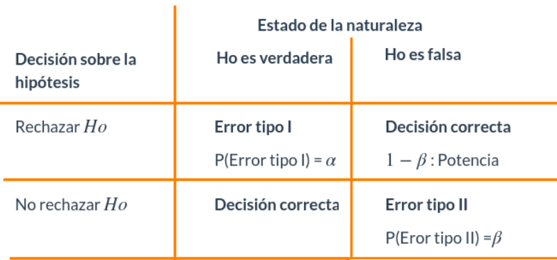

```{r setup, include=FALSE}
knitr::opts_chunk$set(echo = TRUE)
library(ggplot2)
```

<br/><br/>

La significancia estadística es un concepto clave en inferencia estadística que se utiliza para determinar si los resultados de un análisis de datos son lo suficientemente distintos de lo que se esperaría por pura casualidad. En otras palabras, se refiere a la probabilidad de que los resultados observados sean consistentes con una hipótesis nula, que generalmente postula que no hay diferencia o efecto.

Cuando realizas una prueba de hipótesis en estadística, calculas un valor-p  que está relacionado con la significancia estadística. 

Una regla de desición que permite establecer si se rechaza o no una prueba de hipótesis nula en favor de una prueba alterna puede relacionarse con un valor que puede ser 0.05 o en algunos casos 0.01. Este valor indica el límite que establecemos para indicar que las diferencias estadísticas son significativas.


```{r, echo=FALSE, out.width="70%", fig.align = "center"}

```


Es importante tambien establecer que este valor esta asociado con la probabilidad de cometar error tipo I, que consiste en rechazar una hipótesis nula verdadera ( falsos positivos). Que a su vez esta relacionado con el valor de $\beta$ que corresponde a la probabilidad de cometer error tipo II.  

Un menor valor de $\alpha$, implica un mayor valor de $\beta$, que afecta el valor de la potencia de la prueba ($1-\beta$) 

<br/><br/>

El siguiente grupo de gráficos ilustra el efecto que se genera al cambiar el valor de $\alpha$ (probabilidad de cometer error tipo I), sobre los valores de $\beta$ (probabilidaad de cometer error tipo II) y de $1-\beta$ (potencia o poder de la prueba), para el caso de una prueba z de cola superior $$Ho: \mu \leq \mu_o$$ 
$$Ha : \mu > \mu_o$$

Para valores de $\alpha$ iguales a : 0.20, 0.10, 0.05 y 0.01


<br/><br/>

```{r, warning=FALSE, message=FALSE}
# Cargar la biblioteca necesaria
library(formattable)

# Crear un data frame con los valores de alpha, beta y 1 - beta
data <- data.frame(
  alpha = c(0.20, 0.10, 0.05, 0.01),
  beta = c(0.13, 0.25, 0.38, 0.87)
)

# Calcular 1 - beta
data$potencia <- 1 - data$beta

# Crear la tabla formateada con barras de longitud
formatted_table <- formattable(data, list(
  alpha = color_bar("#FC8500"),
  beta = color_bar("#FFB701"),
  potencia = color_bar("#209EBB")
))

# Imprimir la tabla formateada
formatted_table

```

<br/><br/>

```{r, warning=FALSE, message=FALSE}
# https://cran.r-project.org/web/packages/pwrss/vignettes/examples.html
library(pwrss)
power.z.test(ncp = 1.96, alpha = 0.40,alternative = "greater", plot = TRUE, verbose = FALSE)
```

<br/><br/>

```{r, warning=FALSE, message=FALSE}
# https://cran.r-project.org/web/packages/pwrss/vignettes/examples.html
library(pwrss)
power.z.test(ncp = 1.96, alpha = 0.20,alternative = "greater", plot = TRUE, verbose = FALSE)
```

<br/><br/>

```{r, warning=FALSE, message=FALSE}
# https://cran.r-project.org/web/packages/pwrss/vignettes/examples.html
library(pwrss)
power.z.test(ncp = 1.96, alpha = 0.10,alternative = "greater", plot = TRUE, verbose = FALSE)
```

<br/><br/>


```{r, warning=FALSE, message=FALSE}
# https://cran.r-project.org/web/packages/pwrss/vignettes/examples.html
library(pwrss)
power.z.test(ncp = 1.96, alpha = 0.05,alternative = "greater", plot = TRUE, verbose = FALSE)
```

<br/><br/>

```{r, warning=FALSE, message=FALSE}
# https://cran.r-project.org/web/packages/pwrss/vignettes/examples.html
library(pwrss)
power.z.test(ncp = 1.96, alpha = 0.001,alternative = "greater", plot = TRUE, verbose = FALSE)

```

<br/><br/>

En resumen cuando se disminuye el valor de $\alpha$, aumenta el valor de $\beta$ y por tanto disminuye el valor de la potencia de la prueba $1- \beta$

<br/><br/>


Solo atraves del aumento de la muestra se logra la disminución de $\alpha$ y $\beta$ sin afectar la potencia de la prueba.
